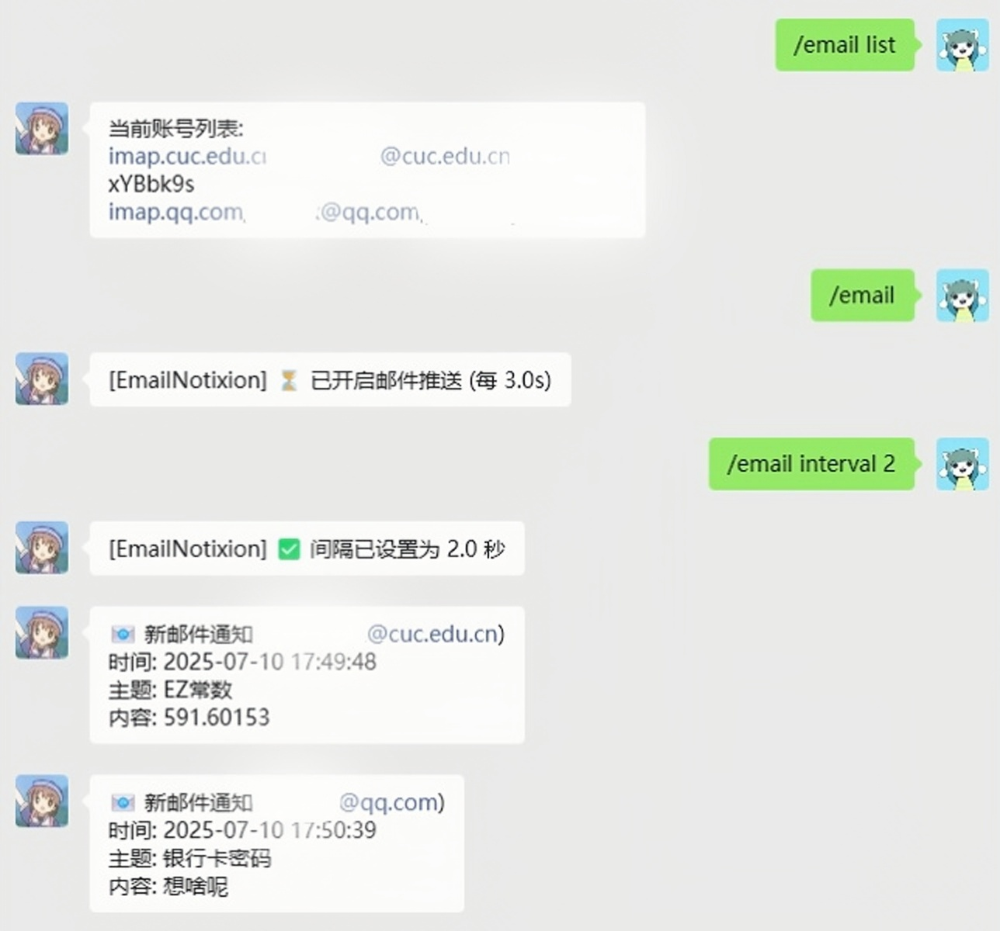

# 📧 EmailNotixion## 🎯 为什么选择 EmailNotixion？ | Why Choose EmailNotixion?

<div a## 🚀 快速开始 | Quick Start

### 📥 安装 Installation

#### 🔌 作为 AstrBot 插件 | As AstrBot Plugin

```bash
# 1️⃣ 克隆到 AstrBot 插件目录
git clone https://github.com/OlyMarco/EmailNotixion.git

# 2️⃣ 重启 AstrBot 或热加载
# Restart AstrBot or hot reload

# 3️⃣ 开始使用！
# Start using!
```

#### 🐍 作为独立 Python 模块 | As Standalone Python Module

```bash
# 1️⃣ 下载 xmail.py 文件
wget https://raw.githubusercontent.com/OlyMarco/EmailNotixion/main/xmail.py

# 2️⃣ 直接在 Python 项目中使用
# Use directly in your Python project

# 3️⃣ 或者直接运行测试
python xmail.py
```

| 🔥 **特性** | 📝 **说明** | 🌍 **Feature** | 📝 **Description** |
|:---:|:---:|:---:|:---:|
| ⚡ **闪电推送** | 1分钟内新邮件即时通知 | ⚡ **Lightning Push** | Instant notification within 1 minute |
| 🔄 **多账号监控** | 同时监控多个邮箱账号 | 🔄 **Multi-Account** | Monitor multiple email accounts |
| 🛡️ **安全可靠** | SSL加密连接，自动重连 | 🛡️ **Secure & Reliable** | SSL encrypted, auto-reconnection |
| 🎨 **简单易用** | 一键命令管理所有功能 | 🎨 **Easy to Use** | One-click command management |

</div>

## 💡 插件定位说明 | Plugin Positioning

### 🤔 什么时候使用 EmailNotixion？ | When to Use EmailNotixion?

> **🎯 群聊推送场景** | **Group Chat Push Scenarios**
> - 📢 **团队协作** - 将重要邮件推送到工作群聊
> - 👥 **多人通知** - 同时通知多个群组或用户
> - 🏢 **企业管理** - 统一管理多个邮箱账号的通知
> - 🔄 **跨平台推送** - 通过 AstrBot 推送到不同聊天平台

### 📱 个人提醒建议 | Personal Reminder Suggestions

> **💭 如果您只需要个人微信/QQ提醒...**
> 
> 对于个人使用场景，您可以考虑更简单的方案：
> - 📧 **QQ邮箱转发** - 将其他邮箱邮件转发到QQ邮箱
> - 📱 **微信QQ邮箱提醒** - 启用微信/QQ的邮箱提醒功能
> - 🔔 **原生推送** - 使用邮箱客户端的原生推送功能
>
> **For personal use scenarios, you might consider simpler solutions:**
> - 📧 **QQ Email Forwarding** - Forward emails from other mailboxes to QQ Email
> - 📱 **WeChat/QQ Email Notifications** - Enable WeChat/QQ email notification features
> - 🔔 **Native Push** - Use native push features of email clients

### 🌟 EmailNotixion 的优势 | EmailNotixion Advantages

**🚀 本插件的核心优势在于：**

- 🏢 **团队协作** - 邮件内容推送到工作群聊，团队成员及时获知
- 👥 **多人管理** - 一个邮箱的重要邮件可以推送给多个管理员
- 🔄 **跨平台整合** - 通过 AstrBot 统一推送到不同的聊天平台
- 📊 **集中管理** - 在聊天界面统一管理多个邮箱账号
- 🎨 **自定义推送** - 可以选择性地推送到特定群组或用户

**🚀 The core advantages of this plugin are:**

- 🏢 **Team Collaboration** - Push email content to work group chats for timely team updates
- 👥 **Multi-user Management** - Push important emails from one mailbox to multiple administrators
- 🔄 **Cross-platform Integration** - Unified push to different chat platforms via AstrBot
- 📊 **Centralized Management** - Manage multiple email accounts in a unified chat interface
- 🎨 **Custom Push** - Selectively push to specific groups or usersgn="center">

**🌟 实时 IMAP 邮件推送插件 | Real-time IMAP Email Notification Plugin 🌟**

**🔧 同时也是独立的 Python IMAP 邮件监控模块 | Also a standalone Python IMAP email monitoring module 🔧**

[](https://github.com/OlyMarco/EmailNotixion/stargazers)
[](https://github.com/OlyMarco/EmailNotixion/network)
[](https://github.com/OlyMarco/EmailNotixion/blob/main/LICENSE)

*🚀 让您的 AstrBot 实时推送邮件通知，再也不错过重要邮件！*

*🚀 Make your AstrBot push email notifications in real-time, never miss important emails again!*

*🐍 独立的 xmail.py 模块可直接用于任何 Python 项目的邮件监控需求！*

*🐍 The standalone xmail.py module can be used directly for email monitoring needs in any Python project!*

</div>

---

## 🎯 为什么选择 EmailNotixion？ | Why Choose EmailNotixion?

<div align="center">

| � **特性** | 📝 **说明** | 🌍 **Feature** | 📝 **Description** |
|:---:|:---:|:---:|:---:|
| ⚡ **闪电推送** | 1分钟内新邮件即时通知 | ⚡ **Lightning Push** | Instant notification within 1 minute |
| 🔄 **多账号监控** | 同时监控多个邮箱账号 | 🔄 **Multi-Account** | Monitor multiple email accounts |
| �️ **安全可靠** | SSL加密连接，自动重连 | 🛡️ **Secure & Reliable** | SSL encrypted, auto-reconnection |
| 🎨 **简单易用** | 一键命令管理所有功能 | 🎨 **Easy to Use** | One-click command management |

</div>

## 🚀 快速开始 | Quick Start

### � 安装 Installation

```bash
# 1️⃣ 克隆到 AstrBot 插件目录
git clone https://github.com/OlyMarco/EmailNotixion.git

# 2️⃣ 重启 AstrBot 或热加载
# Restart AstrBot or hot reload

# 3️⃣ 开始使用！
# Start using!
```

### � 基本使用 Basic Usage

```bash
# 🔥 核心命令 Core Commands
/email                    # 🔄 开关切换 | Toggle on/off
/email on                 # ✅ 开启推送 | Enable push
/email off                # ❌ 关闭推送 | Disable push
/email list               # 📋 查看账号列表 | View account list
/email interval 5         # ⏰ 设置间隔5秒 | Set 5s interval

# 📧 账号管理 Account Management
/email add imap.gmail.com,user@gmail.com,password  # ➕ 添加账号
/email del user@gmail.com                          # ➖ 删除账号
```

## 📚 支持的邮箱 | Supported Email Providers

<div align="center">

| 🏢 **服务商** | 📧 **IMAP 服务器** | 🔒 **端口** | 💡 **示例** |
|:---:|:---:|:---:|:---:|
| **Gmail** | `imap.gmail.com` | `993` | `/email add imap.gmail.com,user@gmail.com,app_password` |
| **Outlook** | `outlook.office365.com` | `993` | `/email add outlook.office365.com,user@outlook.com,password` |
| **QQ邮箱** | `imap.qq.com` | `993` | `/email add imap.qq.com,user@qq.com,auth_code` |
| **163邮箱** | `imap.163.com` | `993` | `/email add imap.163.com,user@163.com,auth_code` |
| **126邮箱** | `imap.126.com` | `993` | `/email add imap.126.com,user@126.com,auth_code` |

</div>

## �️ 高级配置 | Advanced Configuration

### 📋 配置文件 Configuration File

```json
{
  "accounts": {
    "description": "邮箱账户列表，每项格式 imap,user@domain,password",
    "type": "list",
    "default": []
  },
  "interval": {
    "description": "邮件推送间隔（秒）",
    "type": "float",
    "default": 3,
    "hint": "最小 0.5 秒；修改后立即生效"
  }
}
```

### 🔧 自定义间隔 Custom Interval

```bash
/email interval 1     # ⚡ 超快速度 (1秒)
/email interval 5     # 🚀 快速 (5秒)
/email interval 10    # 📈 标准 (10秒)
/email interval 30    # 🐌 省电模式 (30秒)
```

## 🛡️ 安全指南 | Security Guide

### ⚠️ 重要提醒 Important Reminders

> **🔐 密码安全 | Password Security**
> - ✅ 使用应用专用密码 | Use app-specific passwords
> - ❌ 不要使用登录密码 | Don't use login passwords
> - 🔒 妥善保管配置文件 | Keep configuration files safe

### 📧 邮箱设置步骤 Email Setup Steps

1. **🔓 开启 IMAP 服务** | Enable IMAP service
2. **🔑 生成应用专用密码** | Generate app-specific password
3. **📝 使用专用密码配置** | Use app password for configuration

## 🎨 使用示例 | Usage Examples

### � AstrBot 微信聊天界面演示 | AstrBot WeChat Chat Interface Demo

<div align="center">



*📧 EmailNotixion 在微信群聊中的实时邮件推送效果展示*

*📧 EmailNotixion real-time email push effect in WeChat group chat*

</div>

### �📧 邮件通知效果 | Email Notification Effect

```
📧 新邮件通知 (user@gmail.com)
时间: 2024-01-15 14:30:25
主题: 重要会议通知
内容: 明天下午2点会议室A有重要会议...
```

### 🔄 多账号监控 | Multi-Account Monitoring

```bash
# 添加多个账号
/email add imap.gmail.com,work@gmail.com,password1
/email add imap.qq.com,personal@qq.com,password2
/email add imap.163.com,backup@163.com,password3

# 查看所有账号
/email list
```

## 📊 系统要求 | System Requirements

<div align="center">

| 💻 **组件** | 📋 **要求** | 💻 **Component** | 📋 **Requirement** |
|:---:|:---:|:---:|:---:|
| **Python** | `3.8+` | **Python** | `3.8+` |
| **AstrBot** | `最新版本` | **AstrBot** | `Latest version` |
| **邮箱服务** | `支持 IMAP` | **Email Service** | `IMAP support` |

</div>

## 🔧 独立模块说明 | Independent Module Description

### 📦 xmail.py - 独立的 IMAP 邮件接收模块

`xmail.py` 是一个**完全独立**的 Python IMAP 邮件接收模块，可以脱离 AstrBot 单独使用！

`xmail.py` is a **completely independent** Python IMAP email receiving module that can be used separately from AstrBot!

#### 🚀 独立使用方法 | Standalone Usage

```python
from xmail import EmailNotifier

# 创建邮件通知器实例
notifier = EmailNotifier('imap.gmail.com', 'your@gmail.com', 'your_password')

# 单次检查新邮件
notification = notifier.check_and_notify()
if notification:
    email_time, subject, first_line = notification
    print(f"新邮件: {subject}")
    print(f"内容: {first_line}")

# 或者启动持续监控
try:
    notifier.run(interval=5)  # 每5秒检查一次
except KeyboardInterrupt:
    print("监控已停止")
```

#### ⚡ 快速测试脚本 | Quick Test Script

```python
# 直接运行 xmail.py 进行测试
if __name__ == "__main__":
    HOST = 'imap.gmail.com'
    USER = 'your@gmail.com'
    TOKEN = 'your_app_password'
    
    notifier = EmailNotifier(HOST, USER, TOKEN)
    try:
        notifier.run(interval=3)
    except KeyboardInterrupt:
        print("\n程序已停止。")
        if notifier.mail:
            notifier.mail.logout()
```

#### 🔧 核心功能特性 | Core Features

- **🔄 自动重连** - 网络断线自动恢复连接
- **📧 智能解析** - 自动解析邮件主题和正文
- **⏰ 时间过滤** - 只处理1分钟内的新邮件
- **🛡️ 错误处理** - 完善的异常处理机制
- **📱 轻量级** - 无额外依赖，纯Python实现

#### 🎯 适用场景 | Use Cases

> **🔨 开发集成** | **Development Integration**
> - 集成到现有的 Python 项目中
> - 作为邮件监控的基础模块
> - 自定义邮件处理逻辑

> **🧪 学习研究** | **Learning & Research**
> - 学习 IMAP 协议的实现
> - 研究邮件解析技术
> - 作为教学示例代码

> **⚡ 快速原型** | **Rapid Prototyping**
> - 快速实现邮件监控功能
> - 邮件自动化处理脚本
> - 系统监控和告警集成

## 🎯 功能特性 | Feature Highlights

### 🚀 核心功能 Core Features

- **⚡ 实时推送** - 新邮件秒级通知
- **🔄 多账号支持** - 同时监控多个邮箱
- **🛡️ 自动重连** - 网络断线自动恢复
- **🎨 简单管理** - 一键命令操作
- **📊 智能过滤** - 只推送1分钟内新邮件

### 🌟 亮点功能 Highlight Features

- **⚡ Real-time Push** - Second-level notification for new emails
- **🔄 Multi-Account Support** - Monitor multiple mailboxes simultaneously
- **🛡️ Auto-Reconnection** - Automatic recovery from network disconnections
- **🎨 Simple Management** - One-click command operation
- **📊 Smart Filtering** - Push only new emails within 1 minute

## 🤝 贡献指南 | Contributing Guide

我们欢迎所有形式的贡献！| We welcome all forms of contributions!

### 🎯 如何贡献 How to Contribute

1. **🍴 Fork 仓库** | Fork the repository
2. **🌿 创建特性分支** | Create a feature branch
3. **✨ 提交更改** | Commit your changes
4. **📤 推送到分支** | Push to the branch
5. **🔄 创建 Pull Request** | Create a Pull Request

### 🐛 问题反馈 Issue Reporting

遇到问题？| Got issues?

- 🐛 [报告 Bug](https://github.com/OlyMarco/EmailNotixion/issues/new?template=bug_report.md)
- 💡 [建议功能](https://github.com/OlyMarco/EmailNotixion/issues/new?template=feature_request.md)
- 📖 [文档改进](https://github.com/OlyMarco/EmailNotixion/issues/new?template=documentation.md)

## 📄 许可证 | License

本项目采用 MIT 许可证 - 详情请查看 [LICENSE](LICENSE) 文件

This project is licensed under the MIT License - see the [LICENSE](LICENSE) file for details

## 🙏 致谢 | Acknowledgments

- 💖 感谢 [AstrBot](https://github.com/Soulter/AstrBot) 提供的优秀框架
- 💖 Thanks to [AstrBot](https://github.com/Soulter/AstrBot) for providing excellent framework
- 🌟 感谢所有贡献者的支持 | Thanks to all contributors for their support

---

<div align="center">

### 🌟 如果这个插件对您有帮助，请考虑给个 ⭐️

### 🌟 If this plugin helps you, please consider giving it a ⭐️

**🚀 Made with ❤️ by [Temmie](https://github.com/OlyMarco)**

[](https://github.com/OlyMarco)
[](https://twitter.com/OlyMarco)

</div>
