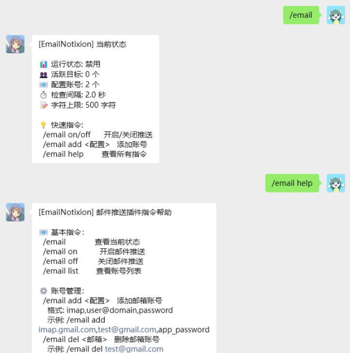
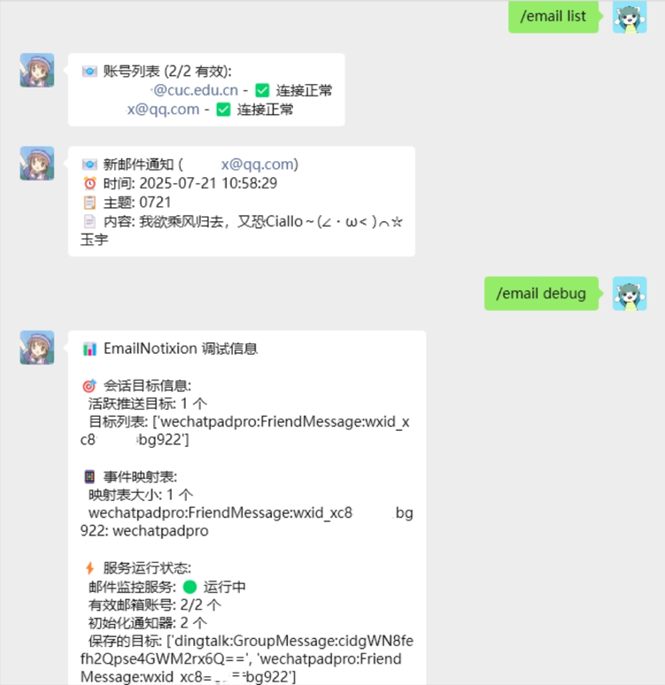

# EmailNotixion - 实时IMAP邮件推送插件

一个用于AstrBot的智能邮件推送插件，支持多账号IMAP邮件监控、跨平台推送和状态持久化。

## 使用效果展示

<div align="center">
  
  
</div>

## 📧 邮箱配置指南

### 工作原理
EmailNotixion v1.0.5 采用**触发式状态恢复**机制：

1. **保存推送目标**：使用 `/email on` 开启推送时，插件会保存当前会话信息
2. **插件重载**：重载后推送状态暂时失效，但配置信息已保存
3. **触发恢复**：当用户在之前配置推送的平台（QQ群/私聊、微信等）发送任何消息时
4. **自动激活**：插件检测到是保存的推送目标，立即恢复推送功能

### 恢复步骤示例
```
# 1. 首次配置（在QQ群）
/email on              # 开启推送，插件保存会话信息

# 2. 插件重载后
Hello                  # 在同一QQ群向机器人发送任意消息
# ✅ 系统自动检测并恢复推送状态

# 3. 无需重新配置
# 邮件推送功能已自动恢复正常
```

### 重要提醒
- ⚠️ **必须主动发送消息**：插件无法主动获取Event对象，需要用户触发
- 🔄 **智能状态恢复** - 插件重载后，用户在推送平台发送消息时自动恢复推送状态
- 📱 **全平台兼容** - 支持QQ、微信、钉钉等所有AstrBot消息平台
- 🏷️ **多账号管理** - 同时监控多个邮箱账号，统一推送管理
- ⚡ **异步高效** - 异步非阻塞设计，多账号并发处理，不影响机器人性能
- 🛠️ **灵活配置** - 可配置推送间隔、字符上限，支持后台管理
- 🔧 **智能解析** - 完美支持HTML邮件、富文本内容和多种编码格式
- 🛡️ **稳定可靠** - 自动重连、错误恢复，智能处理网络异常

## 👀 最新版本 v1.0.5

### 重大更新
- **🔄 智能状态恢复机制** - 插件重载后，当用户在推送平台发送消息时自动恢复推送状态
- **📝 Event对象智能记录** - 通过全局消息监听器捕获用户消息并自动注册推送目标
- **🎛️ 后台管理支持** - 可在AstrBot后台直接管理推送目标和配置
- **⚙️ 配置指令优化** - 新增字符上限设置指令，所有配置实时生效
- **🔧 代码重构优化** - 精简代码结构，提升运行效率和维护性

### 新增功能
- `/email text <数值>` - 设置邮件内容字符上限
- 智能消息监听器自动恢复推送状态
- 自动从metadata.yaml读取版本信息
- 增强的配置重载机制
- 改进的帮助文档和调试信息

<details>
<summary>📚 历史版本更新记录</summary>

### v1.0.4
- **重大更新**：跨消息平台兼容性全面优化
- **消息发送优化**：统一使用 event.send() 方法，确保消息准确送达
- **平台兼容性**：完美支持QQ、微信、钉钉等所有AstrBot支持的平台
- **性能提升**：异步非阻塞设计，多账号并发处理，不影响机器人性能
- **稳定性增强**：优化错误处理机制，提升长期运行稳定性
- **代码优化**：重构消息发送逻辑，消除重复发送问题

### v1.0.3
- **重大更新**：全面支持HTML邮件和卡片消息解析
- 增强HTML邮件解析：优化quoted-printable编码处理
- 智能内容提取：自动过滤CSS样式和JavaScript脚本
- 改进富文本转换：更准确的纯文本提取算法

### v1.0.2
- 增强平台兼容性：支持所有AstrBot支持的消息平台
- 改进邮件内容解析：支持HTML邮件和富文本内容
- 新增内容长度限制：可配置邮件主题和内容的最大字符数

</details>

## 安全注意事项

⚠️ **重要安全提醒**：

### 密码安全
- **本插件将邮箱密码以明文形式存储在配置文件中**，这存在安全风险
- 请务必使用**应用专用密码**或**授权码**，切勿使用账号登录密码
- 定期更换授权码/应用专用密码
- 确保配置文件的访问权限受到适当保护
- 不要在公共场合输入邮箱密码
- 如果安全要求较高，建议通过环境变量等方式管理敏感信息

### 账号管理安全
- 及时清理不需要的账号配置
- 在不使用时及时关闭邮件推送功能
- 定期检查账号列表，确保没有未授权的配置

## 指令说明

### 基本指令：`/email` 或 `/mail`

| 指令 | 说明 |
|------|------|
| `/email` | 显示当前状态信息 |
| `/email on` / `/email off` | 开启/关闭邮件推送 |
| `/email help` | 显示详细指令帮助 |
| `/email debug` | 显示调试信息和目标列表 |
| `/email list` | 查看当前配置的账号列表 |

### 账号管理

| 指令 | 说明 |
|------|------|
| `/email add <配置>` | 添加邮箱账号 |
| `/email del <邮箱>` | 删除指定邮箱账号（精确匹配） |

格式：`/email add imap_server,email,password`

示例：
```
/email add imap.gmail.com,myemail@gmail.com,app_password
/email add imap.qq.com,123456@qq.com,authorization_code
```

### 配置设置

| 指令 | 说明 |
|------|------|
| `/email interval <秒>` | 设置推送间隔（不带参数查看当前值） |
| `/email text <字符数>` | 设置字符上限（不带参数查看当前值） |

示例：
```
/email interval 5       # 设置为5秒检查一次
/email text 100        # 设置字符上限为100
/email interval        # 查看当前间隔
/email text           # 查看当前字符上限
```

## 🔧 配置说明

### 推送间隔设置
- **最小间隔**：0.5秒
- **默认间隔**：3秒
- **推荐间隔**：3-10秒（避免频繁请求导致服务器限制）

### 字符上限设置
- **最小字符数**：10字符
- **默认字符数**：50字符
- **作用范围**：邮件主题和内容的显示长度
- **超出处理**：超出部分显示为"..."

## 🚀 快速开始

### 1. 添加邮箱账号
```
/email add imap.gmail.com,your-email@gmail.com,app_password
```

### 2. 开启邮件推送
```
/email on
```

### 3. 查看状态
```
/email
```

### 4. 重载后恢复推送（自动）
**插件重载后，在需要推送的平台发送任何消息：**
```
Hello  # 在之前开启推送的QQ群/私聊发送任何消息
```
推送状态会自动恢复，无需重新执行 `/email on`

## 🔄 状态恢复机制详解

### Gmail配置
1. 开启两步验证
2. 生成应用专用密码
3. 使用应用专用密码连接

```
/email add imap.gmail.com,your-email@gmail.com,app_password
```

### QQ邮箱配置
1. 开启IMAP服务
2. 获取授权码
3. 使用授权码连接

```
/email add imap.qq.com,123456@qq.com,authorization_code
```

### 其他邮箱
支持所有提供IMAP服务的邮箱，包括163、126、企业邮箱等。

### 删除邮箱账号

⚠️ **重要：删除账号时必须提供完整的邮箱地址，支持精确匹配**

```
/email del user@domain.com
```

**注意事项：**
- 必须提供完整的邮箱地址（包括@域名部分）
- 删除操作使用精确匹配，只会删除完全匹配的邮箱账号
- 删除操作会立即生效，如果邮件推送服务正在运行，会自动重新加载配置
- 删除不存在的账号会提示错误

**示例：**
```
/email del myemail@gmail.com     # 只会删除这个确切的邮箱
/email del test@company.com      # 不会影响 test123@company.com
```

## 🛠️ 高级功能

### 状态持久化机制
v1.0.5版本引入的重要功能：
- **智能状态恢复**：插件重载后，当保存的推送目标在对应平台发送任何消息时，会自动恢复推送状态
- **触发式恢复**：需要用户在配置推送的平台（QQ群/私聊、微信等）发送消息才能触发恢复
- **零配置恢复**：一旦触发，无需重新执行 `/email on`，推送会立即恢复
- **配置持久化**：所有设置在重启后自动恢复，包括推送间隔和字符上限

### 状态恢复机制说明
⚠️ **重要说明**：状态恢复需要用户主动触发
- 插件重载后不会立即自动恢复推送状态
- 需要用户在之前开启推送的平台发送任何消息（包括指令或普通聊天）
- 一旦检测到保存的推送目标活跃，推送功能立即自动恢复
- 这是由于AstrBot框架限制，Event对象需要通过消息事件获取

### 后台管理支持
可在AstrBot管理界面中：
- 查看和编辑活跃推送目标列表
- 管理邮箱账号配置
- 调整推送间隔和字符上限
- 监控插件运行状态

### 智能配置重载
所有配置修改（账号增删、间隔调整、字符上限设置）都会：
- 立即生效，无需重启插件
- 自动重新初始化邮件通知器
- 保持现有推送状态不中断

## 💡 常见问题

### Q: 为什么收不到邮件推送？
A: 请检查：
- 邮箱账号配置是否正确
- IMAP服务是否已开启
- 网络连接是否正常
- 推送服务是否已开启（`/email on`）

### Q: 支持哪些邮箱服务？
A: 支持所有提供IMAP服务的邮箱，包括但不限于：
- Gmail（需要应用专用密码）
- QQ邮箱（需要授权码）
- 163/126邮箱（需要授权码）
- 企业邮箱等

### Q: 如何获取应用专用密码/授权码？
A: 不同邮箱服务提供商的设置方法不同：
- **Gmail**: 账户设置 → 安全性 → 应用专用密码
- **QQ邮箱**: 设置 → 账户 → POP3/IMAP/SMTP/Exchange/CardDAV/CalDAV服务
- **163邮箱**: 设置 → POP3/SMTP/IMAP → 客户端授权密码

### Q: v1.0.5版本状态恢复机制如何工作？
A: 
- **智能监听**：插件使用全局消息监听器，监听所有消息事件
- **触发式恢复**：当保存的推送目标在对应平台发送任何消息时，自动识别并恢复推送状态
- **需要主动触发**：插件重载后需要用户在之前开启推送的平台发送消息才能恢复
- **一次触发有效**：触发恢复后，推送状态会持续到下次重载，无需重复触发

### Q: 为什么插件重载后不能立即自动恢复推送？
A: 
- **框架限制**：AstrBot框架中，Event对象只能通过消息事件获取
- **安全考虑**：插件无法主动创建或获取Event对象，避免潜在的安全风险
- **触发机制**：需要用户在对应平台发送消息，插件才能获取到有效的Event对象
- **设计合理**：这种机制确保推送只在用户活跃的会话中恢复

### Q: 配置文件中的密码安全吗？
A: **不安全**。本插件将密码以明文形式存储在配置文件中，存在安全风险。建议：
- 仅使用应用专用密码，不要使用主账号密码
- 确保配置文件访问权限受限
- 定期更换密码
- 如有高安全要求，请考虑其他解决方案

## 🔧 技术说明

### 核心技术特性
- **异步非阻塞设计**：不会阻塞机器人主线程，确保高性能
- **IMAP UID机制**：基于UID检测新邮件，确保可靠性和准确性
- **智能重连机制**：自动处理连接断开和错误重连
- **跨平台兼容**：统一使用 event.send() 方法，确保跨平台兼容性
- **多账号并发**：支持多账号并发处理，提升监控效率

### 邮件解析能力
- **HTML邮件解析**：完美支持HTML格式邮件解析
- **多编码支持**：支持quoted-printable、base64等编码格式
- **智能内容提取**：自动过滤CSS样式和JavaScript脚本
- **富文本转换**：智能将复杂格式转换为易读的纯文本

### 状态管理机制
- **配置持久化**：所有配置自动保存，重启后恢复
- **Event对象记录**：智能记录推送目标，支持状态恢复
- **实时配置重载**：配置修改立即生效，无需重启

## ⚠️ 安全注意事项

### 密码安全
- **本插件将邮箱密码以明文形式存储在配置文件中**，这存在安全风险
- 请务必使用**应用专用密码**或**授权码**，切勿使用账号登录密码
- 定期更换授权码/应用专用密码
- 确保配置文件的访问权限受到适当保护
- 不要在公共场合输入邮箱密码
- 如果安全要求较高，建议通过环境变量等方式管理敏感信息

### 账号管理安全
- 及时清理不需要的账号配置
- 在不使用时及时关闭邮件推送功能
- 定期检查账号列表，确保没有未授权的配置

## 📝 开发者说明

### 环境变量配置（用于独立运行 xmail.py）

如果需要独立测试 `xmail.py` 模块，请设置以下环境变量：

```bash
# Linux/Mac
export EMAIL_HOST=imap.gmail.com
export EMAIL_USER=your-email@gmail.com
export EMAIL_TOKEN=your-app-password

# Windows
set EMAIL_HOST=imap.gmail.com
set EMAIL_USER=your-email@gmail.com
set EMAIL_TOKEN=your-app-password
```

⚠️ **安全提醒**：绝对不要在代码中硬编码真实的邮箱凭据。

## 🔍 使用建议

- 推送间隔不宜过短，避免被邮箱服务器限制
- 及时清理不需要的账号配置
- 在网络不稳定时可能会有延迟，属于正常现象
- 建议定期检查插件状态，确保正常运行
